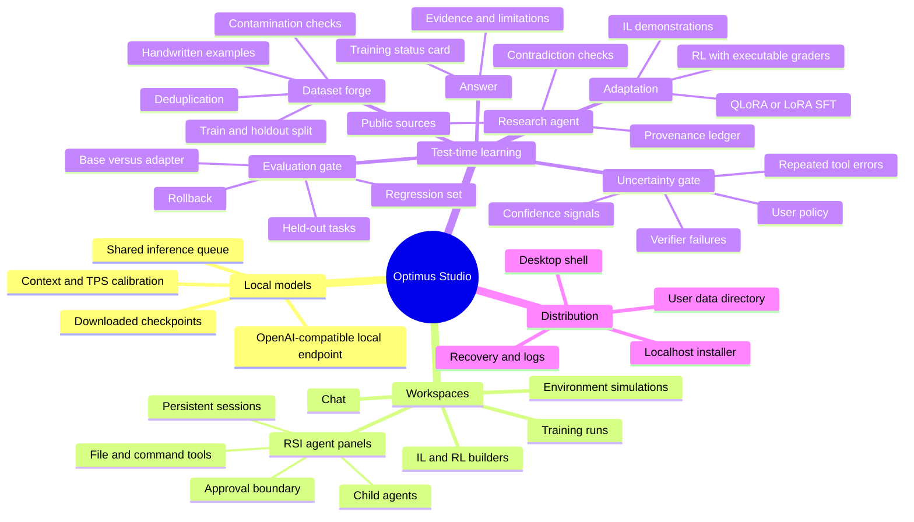
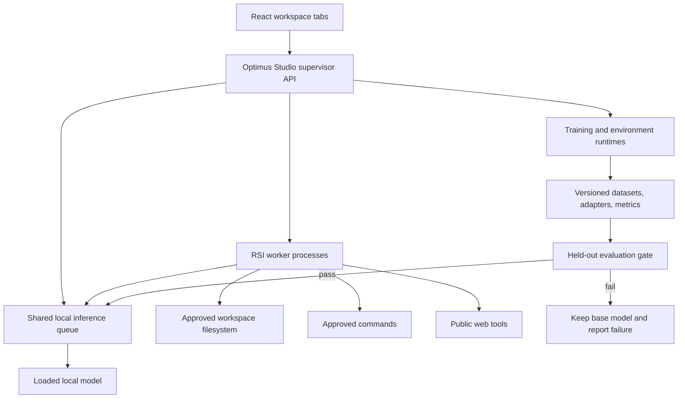

# Optimus Studio: RSI and Test-Time Learning Roadmap

This roadmap defines the product boundary for local agent orchestration and
test-time learning. “Self-improvement” means generating a task-specific,
versioned adapter and evaluating it against a held-out gate. It does not mean
silently rewriting application code, replacing the base model, or declaring
capability gains without an evaluation.

## Product mind map

## Runtime architecture

The supervisor owns session admission, process lifecycle, event persistence,
approval requests, and inference serialization. A panel is never just a visual
tab: it corresponds to a durable server-side record and a supervised worker.
Multiple panels may research or use non-model tools concurrently; requests to a
single loaded MLX model are queued to avoid duplicating model memory.

## Delivery stages and proof gates

### 1. Harness foundation

- Extract a headless RSI runtime from the OpenTUI client.
- Add JSONL/RPC input and structured lifecycle/tool/message events.
- Add workspace-root enforcement and approval requests.
- Persist sessions and recover after UI disconnects.
- Expose the downloaded model through a compatible local inference endpoint.

Proof: an automated disposable-workspace scenario creates a folder, writes and
edits code, executes its tests, reads the result, and survives a worker restart.

### 2. Workspace tabs

- Persist chat, RSI agent, run, and environment tabs.
- Allow `+` to create any supported work surface.
- Parse explicit chat intents such as “launch 3 parallel RSI agent panels”.
- Return a clickable confirmation action that focuses the created tabs.
- Stream panel status without model-mediated polling.

Proof: API and UI tests verify three distinct server-side sessions, tab focus,
close/reopen recovery, and event updates.

### 3. Desktop distribution

- Wrap the same local server and built frontend in a desktop shell.
- Allocate an available loopback port and wait for health before showing UI.
- Reuse `~/.iloptimus`; never create a second incompatible data store.
- Package and smoke-test a macOS artifact, then add Windows/Linux builders.

Proof: a clean artifact launches, detects hardware, loads an existing model,
opens a panel, and exits without orphaned workers.

### 4. Test-time learning

- Detect uncertainty from explicit model confidence, invalid answers, verifier
  results, tool failures, and answer consistency—not prose self-assessment alone.
- Ask user policy before expensive training unless automatic adaptation is
  explicitly enabled with budgets.
- Research with citations and preserve source provenance.
- Build a versioned dataset with deduplication, contamination checks, and a
  holdout set that the trainer never sees.
- Select LoRA/QLoRA SFT, IL, or RL from data and grader availability.
- Train a new adapter, evaluate base and adapter on identical held-out tasks,
  activate only on a statistically meaningful pass, and retain rollback.

Proof: a deliberately hard task triggers the gate, produces a provenance
manifest and dataset, trains an adapter, records base/adapter scores, and either
uses the passing adapter or truthfully reports that adaptation did not help.

## Method selection

| Method | Use when | Required evidence | Do not use when |
|---|---|---|---|
| LoRA/QLoRA SFT | High-quality target responses exist | Clean train/holdout split | Answers are unverified or contradictory |
| IL | Expert traces demonstrate a reusable reasoning policy | Trace graders and correct final answers | Only final labels exist |
| RL | An executable reward can distinguish outcomes | Deterministic environment or grader | Reward is subjective prose without validation |
| Retrieval only | The gap is factual and sources answer it | Citable current sources | The task requires a learned behavioral change |

QLoRA is quantized-parameter-efficient SFT; it changes adapter parameters, not
the frozen base checkpoint. Paged optimizers are an implementation choice used
when the selected training backend supports them, not a separate learning
objective. On Apple Silicon the first supported path is MLX LoRA; features must
not be labeled QLoRA unless the actual backend performs quantized adapter
training.

## Safety and scientific integrity

- No generated training example enters the dataset without a verifier or
  source-backed review state.
- Research pages and tool output are untrusted data, never instructions.
- Holdout tasks are created or reserved before training and never shown to the
  training-data generator.
- Every adapter records base model, dataset hash, method, configuration,
  hardware, code version, scores, and activation decision.
- Failure to improve is a valid result; the system keeps the base model and
  explains what failed.
- Background continuation is event-driven and budgeted. Waiting does not cause
  repeated model calls.
- RSI workers operate within an explicit workspace and approval policy. A
  process boundary improves lifecycle recovery but is not presented as a
  security sandbox.
